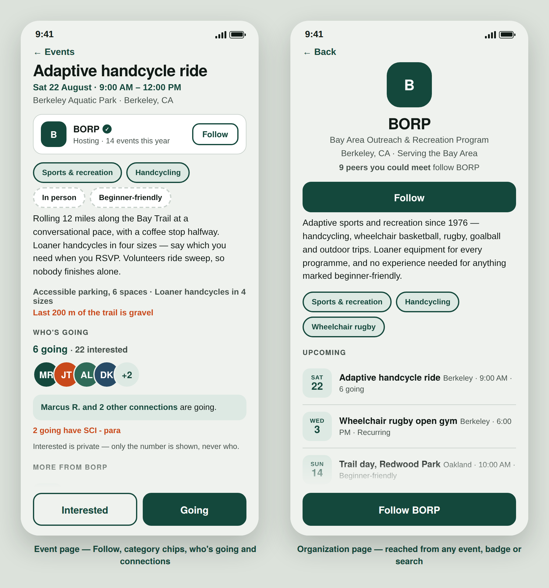
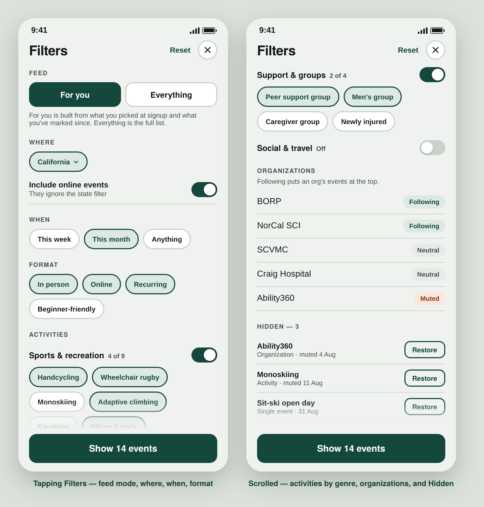

# PeerConnect — PRD

*Find peers. Find mentors. Find something to go to.*

**Status:** v9 · **Owner:** Wojtek · **Last updated:** 18 August 2026

> Living document. Edit it here and open a PR — this replaces the Google Doc versions,
> which lost their images and comments every time they were regenerated.
> Screens live in [`docs/screens/`](screens/) and update with the doc.

---

## 1. Summary

PeerConnect is a mobile app where people with spinal cord injuries find peers, find mentors, and find something to go to. It borrows its mechanics from Bumble BFF — build a profile, browse profiles, connect — and adds an events layer that gives organizations attendance and outcome data in exchange for bringing their members in.

## 2. Problem

Peer mentor programs are matched by hand. At Craig Hospital one coordinator connects newly injured people to mentors out of a spreadsheet, with no way for a mentee to browse and choose for themselves, and no way to see whether a connection actually happened.

The harder half is the mentee side. Reaching out to a stranger is a big ask three months post-injury. So the first thing someone does inside the app should not be composing a message — it should be looking at people who resemble them and events happening this week. Browsing is free once you are in. Filtering is free. Saying hi is one tap. Writing a message comes last.

**Sign-in is required to see members** — see [§5.1](#51-what-is-public-and-what-is-not). Earlier drafts implied you could browse before signing up. That was wrong and is corrected here.

Separately, there is no single fresh list of adaptive events. Every organization runs its own calendar and its own newsletter, and people do not read newsletters. Good events go half empty while people who would have gone never hear about them. **The trap is repeating the same failure in a new wrapper:** if we push events nobody cares about, people learn to ignore our notifications exactly as they learned to ignore the newsletters. Relevance rules are in [§9.4](#94-relevance-so-we-do-not-become-the-newsletter), and they are not optional.

## 3. Who it is for

- **Newly injured people** — want answers and someone who has been there. Hardest to reach.
- **Experienced peers and trained mentors** — willing to help, currently reachable only through a coordinator.
- **Family members and caregivers** — a real mentor category. One of NorCal SCI's 25 listed mentors is a parent rather than a person with SCI.
- **Organizations** — hospitals, foundations and adaptive sports programs who need attendance and outcomes they can report to funders.

**Adults only.** See [§6.2](#62-age-gate--18-confirmed).

## 4. Goals

- A person can sign up in about two minutes and immediately see relevant peers and events.
- A mentee can start contact with one tap, and with something better than "hi".
- A mentor can control how much contact they receive.
- Anyone can find an adaptive event near them — or online — without subscribing to twelve newsletters.
- An organization can see how many connections came out of its events.

**Non-goals for v1:** a discussion forum, a wiki, a classifieds marketplace, distance-based matching, and any matching algorithm beyond disability and location.

## 5. Rough overview

**Peers** and **Mentors** are segmented pills at the top of Discover; **Events** and the rest sit in the bottom bar. Horizontal swipe cycles between Peers and Mentors; the pills do the same with a tap. See [§7.2](#72-gestures).

Two profile depths. Everyone becomes a **Peer** after onboarding. Peers fill in a longer profile later ([§10](#10-completing-your-profile)). Organizations enter through a separate web form and claim flow, not through the app.

**SCI first.** Messaging, seed content and the launch story are SCI, so everyone shares a vocabulary from day one. The schema stays general and nobody is turned away at signup.

### 5.1 What is public and what is not

Two tiers, and the line sits between content and people.

| Public, no account | Behind sign-in |
| --- | --- |
| Events, including virtual ones Organization profiles Marketing pages | Every peer and mentor profile Photos, names, bios, topics Waves, messages, rosters |

Rationale, in order of weight:

- **Erik asked for it.** Craig will not put its mentors behind a public URL, and without Craig there is no mentor seed.
- **Scraping.** A public directory of disabled people with names, photos, injury levels and catheter preferences is training data waiting to be taken, and it is the exact thing CareCure warned about. Member pages carry `noindex`, and the API requires a session.
- **It costs us little.** Events are the public shopfront, they are already public information, and they are the better SEO surface anyway — someone searching "adaptive handcycling near me" lands on an event, not on a stranger's profile.

The honest cost: nobody can evaluate the app before creating an account. Mitigation is that events are genuinely useful without one, and the signup is two minutes.

## 6. Onboarding

Nine screens: welcome, phone number, verification code, then six steps, of which the last two are skippable. Target around two minutes.

| Step | Screen | Notes |
| --- | --- | --- |
| — | Welcome | "A community of peers with disabilities." |
| — | Phone number | Autofilled from the device where the OS allows it. Never shown to members. |
| — | Verification code | Auto-read from the incoming SMS. Skipped entirely on an org invite link. |
| 1 | Name | Display name. First name and last initial is plenty. |
| 2 | Birthday | Age gate and age band. See [§6.2](#62-age-gate--18-confirmed). |
| 3 | Disability | Type, level if SCI, how long you have been disabled, **and what you use**. See [§6.1](#61-disability-duration-and-what-you-use). |
| 4 | Location | "Use my location" or state and city. See [§6.3](#63-location-asked-in-context). |
| 5 | Photo | Optional, skippable. See [§6.4](#64-photos). |
| 6 | Interests | **Optional**, and capped at 20 fixed categories — see [§8.2](#82-chips-only-work-if-the-vocabulary-is-controlled). Moved after the photo; skipping the photo skips this too. |

### 6.0 Making it shorter

Ran's point stands: screens 2 and 3 are the two that add nothing the user wants. We keep phone verification, but reduce it to near-zero cost rather than removing it:

- **Autofill the number.** Both platforms offer it. One tap instead of ten digits.
- **Auto-read the code.** iOS surfaces the OTP above the keyboard; Android's SMS Retriever fills it without a permission prompt.
- **Org invite links skip verification entirely.** A mentor arriving on Erik's link is already vouched for by an organization — a stronger signal than a phone number. See [§11.1](#111-getting-an-organizations-mentors-in--the-seeding-story).
- **Interests moved after the photo and made optional.** They feed the shared-interest line, which is nice but not load-bearing.

**Why keep phone at all:** it is our only anti-spam measure at launch, and a real number is useful for a coordinator who needs to reach someone. If it turns out not to be the bottleneck, it can become optional later — the reverse is much harder.

### 6.1 Disability, duration, and what you use

Three controls on one screen.

**Type** — SCI-para, SCI-quad, TBI, Spina Bifida, Cerebral Palsy, Amputee, MS, Combo, Other. Level appears only for SCI and Combo.

**How long have you been disabled** — a dropdown, not a date. Since birth · Less than 6 months · 6–12 months · 1–3 years · 3–10 years · 10+ years. A bucket is easier to answer than a date, and "since birth" becomes a normal option rather than an escape hatch. Pre-select it for congenital types and let people change it.

> **Implementation note.** Store the bucket *and* `durationAnsweredOn`, and roll people forward — see `currentDuration()` in `src/mocks/selectors.ts`. Otherwise the "newly injured" segment slowly fills with people who are not, and the routing below quietly stops working.

**What you use** — new, and here rather than buried in the mentor flow: manual chair · power assist · power chair · scooter · crutches or walker · walks unaided · prefer not to say. Multi-select, one tap. This exists because equipment is now a top-level filter ([§7.1](#71-filters)), and a filter cannot depend on an optional section of a flow most people never start.

**On Ran's question — is MS part of SCI?** No. Multiple sclerosis is a demyelinating disease of the central nervous system: the immune system attacks the myelin sheath around nerves in the brain and spinal cord. A spinal cord injury is physical damage to the cord itself, usually from trauma. Different cause, different course — MS typically progresses or relapses over time, while an SCI is a single event followed by recovery and adaptation.

What they share is downstream: mobility loss, spasticity, neurogenic bladder and bowel, fatigue, pain. That overlap is why someone with MS can get real value from an SCI peer network and why keeping them in the list is right. It is also why MS has no single onset date and defaults to a duration bucket.

**Time since disability routes the app.** It is the strongest segmentation variable we have.

|  | Under a year | Over a year |
| --- | --- | --- |
| Wants | Answers, proof it gets better | People to do things with |
| Best match | Someone five to ten years ahead | Someone at a similar stage |
| Lands on | Mentors | Peers or Events |
| Tone | Quiet, low pressure | Invitational |

### 6.2 Age gate — 18+, confirmed

Alfred's question was whether an under-18 should be able to find an under-18 mentor. The answer for v1 is no, and everyone landed in the same place: start at 18, revisit later.

PeerConnect lets adults send unsolicited direct messages and routes people toward meeting in person. A minor with a new injury could be messaged privately by any adult and invited to a meetup. No consent checkbox solves that, and it is the kind of thing that ends a hospital partnership rather than starting one. Teenagers with SCI genuinely need peer support — Craig, Triumph and Ability360 already run youth programmes with trained staff and supervision, and the block screen points there rather than just refusing.

Three mechanics that make the gate real:

- **Ask the birthday before stating the rule.** Leading with "you must be 18" tells people what to type.
- **Persist the failure** against device and number, so a blocked person cannot retry with a different year.
- **Keep the date only as long as needed.** Check the age, store the band plus month and day, discard the year.

If under-18s are ever in scope it is a separate mode: verified parental consent, no adult-initiated DMs, moderated conversations, no unaccompanied RSVPs. Legally complicated and far bigger than a date field.

### 6.3 Location, asked in context

No permissions screen. The prompt fires from a **Use my location** button on the "Where do you live?" step, so the request arrives with its reason on screen.

- **State and city fields are always visible**, not revealed after a denial. On iOS a denied location permission cannot be re-prompted, so a reflexive "Don't Allow" would otherwise be a dead end mid-onboarding.
- **Convert and discard.** Reverse-geocode to postal code, city, state, country; store those; throw the coordinates away.
- A **Show me in browse** toggle sits on the same screen, defaulted on.

**Notifications are not asked for during onboarding.** Ask at the first wave received: "Someone waved at you. Want to know when that happens?" Highest intent in the product, and iOS gives exactly one chance at that dialog.

> **PWA note.** On iOS, web push only works once the app is added to the Home Screen. The first-wave moment becomes two steps — add to Home Screen, then permission — and needs its own design.

### 6.4 Photos

Optional and never required — not for Peer, not for the Mentor badge. A required photo silently filters out the hardest-to-reach users. Last step, skippable, upload or camera, and **skipping leaves no visible hole**: no nag bar, no completeness meter. The generated initial tile reads as a design choice; a grey silhouette reads as broken.

Also: an **alt-text field**, and **photo visibility separate from profile visibility** — photo plus disability plus city is identifying, and someone in a small town should be able to show a face to members without it being on the open web. For mentors, guide the shot: doing something you love, face visible.

## 7. Peers and Mentors

The tab is **Peers**, not People — it is the word the community uses and the word the rest of the product uses.

### 7.0 Full-bleed cards

Modelled directly on Bumble BFF. **The photo is the card.** It fills the frame edge to edge, roughly two thirds of the screen, and everything else sits on top of it: name and details over the image at the top, bio and interest pills over a dark scrim at the bottom, and a large circular wave button in the lower right. One card per screen, scrolled vertically.

- **A photo carries what text cannot** — the chair, posture, hand function, whether someone is outside doing something. A newly injured quad seeing another quad on a trail gets "this is possible" in a way no bio delivers. Giving it the whole frame is the point.
- **Density advertises emptiness.** At launch a state may hold three people. A compact list of three rows makes a screen that is visibly nine-tenths blank; three full-screen cards read as a considered selection rather than everything we have. **We are deliberately trading profiles-per-screen for how the screen feels when there are few.** Revisit when a typical state returns twenty or more.
- **The wave is a large circular button on the card**, not a small link in a row. It is the primary action in the product and should be the largest tap target on screen.

What sits on the card, in order: name, then **disability, level and what they use** — where Bumble puts age and city, we put the things that decide whether this is the right person. Age and city go on the second line. A pill shows time since injury. The bio truncates at three lines. Interest pills scroll horizontally along the bottom and deliberately run off the edge, which signals there is more.

Where there is no photo, the generated initial tile fills the same frame — a large block of colour with the initials, which reads as a design choice rather than a missing image. This is what makes the photo genuinely optional ([§6.4](#64-photos)).

Mentor cards add the org badge and capacity. **Watch this one:** a full-bleed card shows less at a glance, and Mentors is closer to a decision than a browse — someone is comparing four people on whether they are open and what they will discuss. It may want a shorter card than Peers. Judge it on a real phone.

**Navigation follows from the card.** With cards this large, Peers and Mentors become segmented pills at the top of a Discover surface rather than top-level tabs, and the bottom bar carries sections: **Discover · Events · Chats · Activity · Me**. That is Bumble's structure and it is defensible here — Events is not a kind of person, and Chats and Activity need somewhere to live. It does supersede the three-tab model in [§5](#5-rough-overview); if we would rather keep Peers / Mentors / Events as the bottom bar, the card design still works, but Chats and Activity need another home.

### 7.2 Gestures

- **Horizontal swipe cycles Peers and Mentors.** Left or right moves between the two segments, and the top pills do exactly the same thing with a tap. Two segments only, so it stops at each end rather than wrapping — with two items a wrap reads as a glitch.
- **Vertical scroll moves through cards**, one card per screen.
- **Swipe is an accelerator, never the only way.** Every gesture has a tap equivalent, because switch control, keyboard and VoiceOver users cannot reliably swipe. This is the same rule that ruled out swipe-to-decide in the first place.

**Two gesture conflicts to handle, both real:**

- **The interest pills at the bottom of a card scroll horizontally.** A drag that starts on that strip scrolls the pills; it must not change segment. Standard nested horizontal scrolling — the inner scroller claims the gesture, and only hands it up once it hits its own end.
- **iOS reserves the left screen edge.** In a PWA or browser tab, a swipe starting within roughly 20px of the left edge is the system back gesture and we do not get it. Ignore gestures originating at the very edge rather than fighting for them, or people will get inconsistent behaviour depending on where their thumb landed.

### 7.1 Filters

| On the bar | Behind Filters |
| --- | --- |
| State · Disability | **Equipment** · **Organization** · Level · Time since disability · Languages · Topics · Age band |

**Equipment earns its place.** Ran is right that manual versus power is a large difference in daily life — arguably larger than two levels of injury — and someone in a power chair mostly wants to talk to someone in a power chair. It stays one tap away rather than on the bar because the bar has room for two chips on a phone. If usage says otherwise, swap disability out.

**Organization as a filter** means someone can find their own hospital's mentors, which is exactly how a person referred by Craig will look.

## 8. Profile and the wave

A profile carries the photo, bio, what they use, the topics they will discuss, interests, languages, equipment, grants and affiliation. The primary action is **Say hi** — one tap, no words required.

- **Peer to peer:** a wave back opens the thread. Either side can message first instead.
- **Anyone to a mentor:** if the mentor is open, the wave lands in their inbox and the thread opens immediately. No mutual match — mentors have already volunteered.
- Waves arrive in their own inbox, separate from messages, and are rate limited.
- Mentors set capacity: open, at capacity, or paused.

### 8.1 Ask me about — a filter, not a one-tap question

Every profile lists what someone will discuss, under the heading **Ask me about**. Each item is tappable, and **tapping it filters the browse deck to everyone who talks about that** — it does not send a message.

This reverses the v5 decision. The earlier design had a chip compose *"I have a question about suprapubic catheters"* and send it in one tap, which solved the blank-page problem. It also **made asking too cheap.** We have roughly 25 mentors and no upper bound on mentees, and volume is what overwhelms a mentor, not the quality of any single message. Friction in front of the first message is a feature, not a defect.

So the chips behave the same as interests and affiliation: they are discovery, not contact. Contact stays behind the wave and the message, where the capacity controls apply.

**The blank-page problem is still real**, and if we want to solve it later the right place is inside the compose step — a "what's this about?" picker that pre-fills the opener once someone has already decided to write. That keeps the help without turning a browse tap into an outbound message.

**The volume controls that actually matter** are elsewhere and should be built rather than assumed: mentor capacity states (open, at capacity, paused), a rate limit on waves per person per day, and the ability to turn off unsolicited contact entirely.

### 8.2 Chips only work if the vocabulary is controlled

Measured against the 25 NorCal mentor profiles, where topics are free text as written by each mentor:

| | |
| --- | --- |
| Distinct topic strings | 104 |
| Strings that match exactly one person | 83 |
| Strings that match three or more | 8 |

**Four out of five topic chips are a dead end** — you tap it and get back the person whose profile you were on. The eight that work are the ones drawn from Craig's fixed Q10 and Q23 lists: *Wheelchair assist devices* returns 17 people, *Vehicle modifications* 9, *Suprapubic catheter* 5. The free-text ones — "other adaptive equipment", "self and supra-pubic cath", "moving back in with family after injury" — return one each, because nobody phrases it the same way twice.

The same applies to interests. Raw text like "1960s car restorations" or "has been to all seven continents" reads well and matches nobody. Mapping the 25 mentors onto **20 fixed interest categories** puts 23 of them into at least one, and makes the shared-interest line on a card mean something: Cooking & food 10 people, Wheelchair sports 9, Family & pets 7, Reading & writing 7.

**So: two fields, two jobs.**

- **A controlled list** drives chips, filters and matching. Interests are capped at 20 categories. Topics come from the Craig lists.
- **Free text** is kept and displayed — *"In their words: cooking, reading, swimming, hiking, kayaking"* — because it is what people actually read on a profile.
- **Imported profiles get mapped on the way in**, keeping the person's own wording for display. Where a free-text answer becomes common, it graduates into the controlled list.

Only controlled-vocabulary items should be tappable. A chip that returns one result is a broken promise.

### 8.3 Connections

**A connection is anybody you have interacted with** — you waved at them, they waved at you, you exchanged a message, or you added each other after an event. No request, no accept screen, no separate inbox. The list builds itself out of things people were already doing.

**It is called Connections, not friends**, because it is the same object as the number we sell to organizations — *connections formed per event* ([§9.3](#93-check-in-and-the-organization-loop)). One word for the thing and the metric.

What it is for, in order of value:

- **"2 connections are going"** on an event card and event page. Knowing someone will be there is the difference between reading about a ride and turning up to it, and for this audience turning up is the expensive part.
- **A list of people you have met**, so the person you talked to at a rugby night in March is findable in June.
- **Post-event "add the people you met"** ([§9.3](#93-check-in-and-the-organization-loop)) — the highest-yield moment there is, and the same mechanic Meetup uses.

Three rules keep a one-sided list honest:

- **Connections are private.** Your list is yours; nobody sees who you are connected to, and there is no public count on any profile. This matters more here than on a general social network — a mentor's list is, in effect, a list of people who reached out for help, and it must never be visible or countable from outside.
- **Interacting is not endorsing.** A connection is a record of contact, nothing more. It grants no extra access to a profile, and it never unlocks anything that sign-in did not already.
- **Removable and blockable, silently.** Removing a connection tells the other person nothing.

**Mentor threads sit outside this by default.** Somebody working through a hard first year should not accumulate as a mentor's connection list, and a mentee should not read a support conversation as a friendship. A mentor can add a connection deliberately; it does not happen because a wave arrived.

> **Open.** Whether *"Marcus is going"* should appear to you when Marcus never replied to your wave. It is your own list, so nothing leaks — but it can read as a closer relationship than exists. The likely answer is to weight reciprocated contact above one-sided contact when deciding whose names to show first, without splitting the list into two tiers in the interface.

## 9. Events

A dated list, filtered by state and time window. Each card carries the date, event, host organization, place and time, and the line that drives attendance: **who else is going, and how many share your injury level** — plus the interested count, shown separately (see [§9.0](#90-interested-and-going)).

**Recurring groups are seeded first.** Standing weekly and monthly groups never go stale, so the tab always renders something in a quiet month. Badged as recurring rather than given an RSVP.

The screen uses the same chrome as Discover — the segment pills and filter button at the top, the shared bottom bar below — so moving between people and events changes the content and nothing else. Source for the mockup is in [`docs/screens/events-screen.html`](screens/events-screen.html).

### 9.0 Interested and Going

Two levels of commitment, not one.

| | **Interested** | **Going** |
| --- | --- | --- |
| Weight | Secondary button | Primary button |
| Saves the event | Yes | Yes |
| Reminders | Yes, and a nudge to convert nearer the date | Yes |
| Counts toward the public "who's going" line | No — shown separately as interest | Yes |
| Appears on the attendee roster | No | Yes |
| Unlocks the virtual join link | **No** | Yes |
| Prompts check-in on the day | No | Yes |
| Offers Add to calendar | Yes | Yes |

**Why it earns its place.** Deciding to show up somewhere in person is a large commitment for this audience — unknown accessibility, transport, energy, bowel and bladder timing. Interested lets someone keep an event without deciding they can make it, which is the same friction the wave removes from messaging. It is the event rung on the same ladder: read → interested → going → checked in.

**It also produces the most useful signal on the org dashboard.** A ride with 30 interested and 4 going is not an unpopular event, it is an event with a logistics problem. That gap tells an organization to publish accessibility details, arrange transport, or move the start time — none of which they can learn from an attendance number alone. Track and show both.

**Rules that keep it honest:**

- **Interest is never presented as attendance.** The card says "6 going · 22 interested", never a combined figure. Inflating attendance to look busy is the fastest way to lose an organization's trust in our numbers.
- **The join link stays behind Going.** Otherwise Interested becomes the default and RSVP means nothing.
- **Convert with information, not nagging.** A single reminder before the event that leads with who else is going and how many share your injury level, not "you said you were interested".
- **Interested is private by default.** It says something about what someone is considering; Going is a public act.

### 9.8 The event page

Tapping a card opens the event. It carries what a card cannot: the full description, the tags, the access detail, who is going, and the organization.

**The organization row sits directly under the title**, with logo, verification state and a **Follow** button. This is the highest-intent moment for following an org — someone is already looking at their event — and it is where most follows will come from. Tapping the row opens the org page ([§11.3](#113-the-organization-page)).

**Category chips** — genre, activity and format — from the same controlled vocabulary as everything else. Each is tappable and filters Events by that tag. Free-text description below them; the chips are for finding more like this, the prose is for deciding about this one.

**Access is reported by exception, not as a checklist.** An earlier draft listed every access field on the page — step-free route, accessible restroom, accessible parking and so on, each ticked. It is the wrong trade: on an adaptive sports listing hosted by an adaptive sports organization, step-free and an accessible restroom are the assumption, and six green ticks confirming the obvious push who's going below the fold.

So: **the page shows access only where it departs from the assumption.** One quiet line when everything is standard — "Accessible parking, 6 spaces" — and a clay-coloured line when something is not: *"No accessible restroom on site"*, *"Last 200m is gravel"*, *"No captions"*. Silence means standard.

Two conditions make that safe, and neither is optional:

- **The org still answers the full checklist** when they create or claim the event. We collect all of it; we only render the exceptions. That keeps the data available for filtering and for the org dashboard without spending page space on it.
- **Unknown is not the same as fine.** An event ingested from a scraped calendar has answered nothing, so its page carries a single honest line — "Access details not listed — ask the organizer" — rather than implying a standard it never claimed. This is also the nudge that gets orgs to claim their listings.

#### Who's going

| | Shown |
| --- | --- |
| Counts | **"6 going · 22 interested"**, always both, never combined |
| Going | Names and photos, subject to the host's roster visibility ([§9.2](#92-virtual-events)) and each member's own show-me toggle |
| Interested | **The number only. Never who.** Interested is private by default ([§9.0](#90-interested-and-going)) and stays that way here |
| Connections | **"Marcus R. and 2 other connections are going"** — drawn from your own list ([§8.3](#83-connections)) |
| Similarity | "2 going have SCI - para" — the line that does the most work for a newly injured person |

**Support-group-shaped events default to no names at all**, only counts. The host controls this per event, and the conservative default applies to anything tagged as a support group. A member who has switched off *show me in browse* is not listed either.

Below that: **more from this organization**, add to calendar ([§9.5](#95-add-to-calendar)), the join link for virtual events once you are Going, and the small **too far / wrong time** link that sends logistics feedback to the org dashboard.

**Interested and Going are pinned to the bottom** of the page rather than sitting inline, so the decision is reachable without scrolling back.

### 9.5 Add to calendar

Both Interested and Going offer **Add to calendar** on the confirmation. Two routes, and ship both: a downloadable `.ics` file, which every phone handles, and a Google Calendar template link for people living in Google.

What goes in the entry:

| Field | In-person | Virtual |
| --- | --- | --- |
| Location | Full street address, so the phone can navigate to it | Left empty |
| Description | Event blurb, host org, accessibility notes, link back to the event in the app | Blurb, org, **the join link**, link back to the app |
| Alarm | Default reminder the day before, and one an hour before | Same |

**The privacy catch, and it needs a decision.** Section 9.2 says virtual join links are never public, because support groups get crashed. Putting the link in a calendar entry moves it somewhere we do not control — a work calendar, a shared family calendar, a third-party app with calendar scope. That is a plausible way a Men's SCI group link ends up somewhere it should not be.

Three options, in order of preference:

1. **Per-user join links.** Each attendee gets their own URL, revocable individually. A leak becomes traceable and fixable rather than fatal. Most conferencing platforms support this; check before committing.
2. **Link to the event page in the app, not the meeting.** The calendar entry says "open in PeerConnect to join". One extra tap, and the link never leaves our control. This is the safe default if per-user links are not available.
3. Put the raw link in and accept the risk — only acceptable for open, public events.

Use option 2 for anything support-group-shaped, which is also how the roster visibility rule already works.

**Stale entries are the other problem.** A one-off `.ics` import is a snapshot: if the ride moves or is cancelled, the calendar still says it is on. Two mitigations — set a `UID` and increment `SEQUENCE` so a re-import updates rather than duplicates, and offer a **subscribable feed** (`webcal://`) of the person's Going and Interested events, which stays in sync on its own. The subscription is the better answer and not much more work.

### 9.6 Your events

A view of everything the person marked, split into **Going** and **Interested**, with past events kept below as a history.

**It belongs in the Events tab as a second segment — "All" and "Mine" — not buried under Me.** Someone looking for what they signed up for is thinking about events, not about their account, and Me should stay identity and settings. Link to it from Me as well, but the home for it is where the browsing happens.

The history matters more than it looks: it is the raw material for the interest model below, it is what "add the people you met" hangs off after an event, and it is how someone remembers the name of the group they liked three months ago.

### 9.7 Tags, relevance, and the filter sheet

**The risk here is volume, not scarcity.** Once ingestion works — every partner calendar, every newsletter, plus virtual events that deliberately ignore the state filter — a feed showing everything will be mostly irrelevant to any one person. A feed where four in five items do not apply to you teaches you to stop opening the tab, which is the newsletter failure in a new wrapper.

**Muting is a correction, not the mechanism.** If someone has to hide 80% of the feed by hand, the default was wrong. Relevance has to come first, and the mute tools exist to fix what relevance gets wrong.

#### Three tag namespaces, and a genre above them

| Level | Examples | Why it exists |
| --- | --- | --- |
| **Genre** | Sports & recreation · Support & groups · Skills & services · Social & travel · Advocacy | The blunt lever. "I don't want sports events" removes a large share in one tap. |
| **Activity** | Handcycling · Monoskiing · Adaptive climbing · Peer support group | The same controlled vocabulary as profile interests |
| **Organization** | NorCal SCI · BORP · Craig Hospital | Follow or mute a whole org |
| **Format** | Virtual · In person · Recurring · Beginner-friendly | Filters, rarely muted |

**Activity tags must be the same list as profile interests.** One vocabulary across people and events, so saying you are into handcycling surfaces both handcyclists and handcycle rides, and marking a ride interesting improves your people feed too. Same rule as [§8.2](#82-chips-only-work-if-the-vocabulary-is-controlled).

#### Two feed modes

- **For you** (default) — built from what the person chose at signup plus what they have marked since, with a small discovery slice of things adjacent to their interests. This is the answer to the 80% problem: the feed is opt-in by activity, not opt-out.
- **Everything** — the full list, one toggle away, for people who want to browse rather than be served.

A person who picks nothing at signup gets Everything by default, because we have nothing to filter on. Prompt them to narrow it once they have marked a few events.

#### Not interested

The **×** in the top right of every event card. Tapping it asks one question, and the question is **what to stop showing**, not why — it names the thing on the card rather than asking the person to describe their own taste:

| What we offer | Worded from the card | What it does |
| --- | --- | --- |
| The **organization** | "Stop showing BORP events" | Mutes the org. The biggest lever on this card, and the one people reach for first |
| The **activity** | "Stop showing handcycling" | Mutes the activity tag, and down-weights it in the interest model |
| The **category** | "Stop showing online events" · "Stop showing recurring groups" | Mutes the genre or the format, whichever the card carries |
| **Just this one** | "Hide this event" | Hides the single event, touches nothing else |

Naming the specific org and the specific activity is what makes the sheet answerable in a second. "Not this kind of thing" asks someone to classify their own preferences; "Stop showing BORP events" is a yes or no about something already on screen.

Two rules that keep it from over-firing:

- **Offer only what the card actually has.** A card with no org badge does not offer an org mute, and an in-person one-off does not offer the format row. Three options are plenty; five is a form.
- **Every mute is announced and reversible.** The toast says what was muted and offers undo, and the same mute appears under **Hidden** in the filter sheet with a one-tap restore.

**Too far, or wrong time is a separate control**, not a mute. It stays on the card as its own small link, because it is **logistics feedback** for the organization's dashboard rather than a signal about the person's interests — a ride with 30 interested and 4 going has a transport problem, and this is where we learn that.

#### The filter sheet

A filter button at the top of Events, in the same position and the same shape as the one on Discover. It is both the filter *and* the settings screen, so that mutes are findable in the same place they were created — a hidden filter someone cannot locate is a bug they will report as "the app stopped showing me anything".

**Three chips sit on the bar, everything else is behind the button.** The chips are **For you**, the **state**, and the **time window** — mode, where, when. They are the three a person changes while browsing; the rest are set once and left alone. The For-you chip carries a caret, because tapping it switches to Everything without opening the sheet.

Contents:

- **For you / Everything** toggle
- **Activities**, grouped under their genres, each toggleable, with the genre header toggling the lot
- **Organizations** — followed, neutral, muted
- **Format** — in person, online, recurring
- **Where** — state, and whether to include online
- **When** — this week, this month, anything
- **Hidden**, listing everything currently muted with a count and a one-tap restore

Everything set here persists, and everything is reversible.

Three details in the mockup that are decisions, not decoration:

- **The primary button carries a live count** — "Show 14 events". The number falls as filters narrow, which is the cheapest possible guard against someone filtering themselves into an empty tab.
- **Genre headers are switches, activity chips are selections.** "4 of 9" says a genre is partly on without opening it. Switching a genre off collapses its chips rather than clearing them, so the selection comes back intact.
- **Hidden says what kind of thing each mute was** — an organization, an activity, a single event — and when. Without the label, restoring is a guess.

**Reset clears filters, not mutes.** Mutes are cleared one at a time from Hidden, because a single tap that silently unhides everything someone deliberately removed is not reversible in any way they would notice.

#### The interest model

A per-person weighted score per activity tag, from: interests chosen at signup (explicit, highest weight), Going (strong), Interested (moderate), opening an event or profile with that tag (weak), Not interested (negative), all decaying over time. Simple weights are enough at this size — no ranking model is needed to know that someone who marked three handcycle rides likes handcycling.

**Make it visible and editable.** This is behavioural profiling of disabled people's activity, health and social choices, so a hidden model is a trust problem rather than a clever feature. Me shows **Your interests**, listing what we inferred alongside what they chose, each removable, and events carry a quiet "why am I seeing this?" naming the tag. Nothing leaves the account: organizations see aggregate counts for their own events, never an individual's inferred interests.

#### When the feed goes thin

Heavy muting plus a sparse state can empty the tab. When that happens, **say what is hidden rather than silently unhiding it**: "You've hidden most local activities — 12 events are hidden. Show them, or see what's on online?" Both options one tap. Never quietly serve muted content back, and never leave a blank screen with no explanation.

### 9.1 Keeping the list fresh

Freshness is the whole risk of this tab, and it is a job, not a script. **Name an owner.** One person owns event ingestion — adding sources, watching the review queue, chasing dead feeds. If nobody owns it, it decays in about six weeks and the tab becomes a liability.

Three ingestion routes, in order of reliability:

1. **Calendar feeds.** Most organizations publish a calendar, and many expose iCal or RSS behind it. Re-sync nightly. The only route that self-corrects when an event is cancelled or moved.
2. **Newsletters.** A dedicated inbox subscribed to every organization's list, parsed into candidate events. Reaches the many programs that announce by email and never update a calendar. Parsed events land in a review queue, not straight into the tab.
3. **Aggregators and scraping.** sportsabilities.com and adaptiverechub.org for breadth at launch.

**Rules that keep it honest:** every event shows its source and last-verified date; anything missing from its feed for two sync cycles is unpublished automatically; past events disappear the next day; a claimed organization's own edits beat the scraper.

### 9.2 Virtual events

In scope, and the only content that makes the tab non-empty *everywhere*. Someone in Boise has nothing local on day one but can still join a monthly. Seed with the AbleBodied monthly, the Men's SCI group, and partner sessions.

- **They ignore the state filter**, with a toggle to hide them. When a state filter returns nothing local, the empty state fills with virtual. See `filterEvents()` in `src/mocks/selectors.ts`.
- **Cards show time zone, not city** — "Online · 7:00 PM PT", with the viewer's local time when it differs.
- **Join in one tap, from the app.** Once you have RSVPed, the event page carries a Join button that opens the meeting directly. A reminder with the same button fires shortly before. The link is never on a public card: support groups have been a recurring target for meeting disruption.
- **Check-in without a QR code.** The host opens a check-in window that attendees confirm in the app, or marks the roster afterwards.
- **Rosters are more sensitive here.** Host sets visibility per event — full roster, first names only, or off — and support-group-shaped events default to conservative.

**Pilot:** run the AbleBodied monthly through the full loop first.

### 9.3 Check-in and the organization loop

Members RSVP and see who else is going. They check in on the day, which unlocks the attendee roster — visible only to people who attended. Afterwards: a shared photo album, one-tap "add the people you met", and a testimonial prompt two days later.

**Why an organization will push adoption.** The dashboard gives them attendance over time, **new connections formed between attendees**, testimonials with consent for grant reports, and repeat attendance. "12 events for 340 people" is a weaker grant line than "12 events and 190 new peer connections". We can produce the second number; nobody else can. **This is the single clearest thing we give organizations, and it should lead every conversation with one.**

### 9.4 Relevance, so we do not become the newsletter

The failure mode is not an empty feed, it is a full one that is mostly irrelevant. Irrelevant notifications and irrelevant listings both teach people to stop looking, and then we have rebuilt the thing we replaced.

The tag model, feed modes, mute tools and filter sheet are specified in [§9.7](#97-tags-relevance-and-the-filter-sheet). Two things that sit outside it:

- **Notification budget.** A hard cap per person per week, spent on the highest-scoring item rather than everything that qualifies. Digest by default; immediate only for waves and messages.
- **Measure it as a health metric.** Notification open rate, mute rate, and the share of shown events marked not-interested. **If more than about one in five shown events gets hidden, the defaults are wrong** — fix relevance rather than adding more mute tooling.

## 10. Completing your profile

The Craig survey reshaped from a one-shot questionnaire into a living profile. **Sectioned and saveable**, and **every field earns its place** — a question goes in only if it becomes a filter or a visible line on the profile.

**It is no longer framed as becoming a mentor.** The same information makes an ordinary peer easier to find and improves the events and people we put in front of them, and calling the whole flow "become a mentor" turns away everybody who is not sure they are one. So the entry point says what it does:

> **Complete your profile**
> Better matches for events and peers. And it's how people find you.

**The entry point lives on Me**, always available, with a progress ring — self-initiated and private. It does **not** become a nag bar, a percentage on your card, or a badge other people can see; the rule in [§6.4](#64-photos) about skipping the photo leaving no visible hole still holds everywhere it is visible to others.

**Prompting still happens on a signal, not at signup.** After a few replied waves, or after attending an event: "You have helped three people this month. Want people to be able to find you?"

### 10.0 The explicit mentor question

**Filling anything in never makes you a mentor.** It is one deliberate question, asked once, with the consequences stated on the same screen:

| If you say yes | |
| --- | --- |
| You appear in **Mentors** | A separate tab from Peers |
| People can **message you first** | No wave back needed — you have volunteered |
| You set your **capacity** | Open · at capacity · paused |

**Not now** is a first-class answer and changes nothing about the profile you just filled in. This is the separation that matters: somebody can complete every section because they want better event matches, and still never take a message from a stranger.

An organization can vouch for you on top of that, which adds their badge. Without one you are listed as an **experienced peer** ([§12](#12-mentors-and-verification)).

### 10.1 The sections

Two tiers, ordered by what each buys the person filling it in.

| Tier | Section | Fields | Craig |
| --- | --- | --- | --- |
| **About you** — helps matching | **In your own words** | The bio. See [10.1.2](#1012-in-your-own-words--the-bio) | — |
| | **Your photos** | Up to six, tagged. See [10.1.3](#1013-your-photos) | — |
| | Interests and activities | Top 3, mapped to the 20 fixed categories | Q22 |
| | Equipment you own | See [10.2](#102-equipment-you-own) | — |
| | Languages | Multi-select | Q4 |
| **Willing to help** — makes you findable | Your injury | Type; level; complete / incomplete / don't know; age at injury; how you were injured | Q5–Q9 |
| | Life now | Independence; relationship; children and pre- or post-injury; education; employment and field | Q14–Q21 |
| | Ask me about | **Topics I'm happy to talk about**; self-care devices and procedures | Q10, Q23 |
| | Grants you've received | See [10.3](#103-grants-received) | — |
| **Your story** — the part people read | Three questions, with photos and video | See [10.5](#105-your-story--the-three-questions) | — |

**Anyone can do the first tier and stop.** It is the half that pays off the same day, and it asks nothing about how you were injured or who you live with. The second tier is what makes a profile useful to a stranger three months in, and it is where the word *mentor* starts to fit.

**Free text beats a fixed list where the Craig options run out.** NorCal's mentors describe topics well outside Craig's checkboxes — pregnancy during paraplegia, business ownership, infertility, emergency preparedness. Keep the checklist for filtering and free text for the rest, and let popular free-text answers graduate into the list.

### 10.1.1 What we take from the Craig survey, and what we drop

The survey is 25 questions built for a coordinator's spreadsheet, not for a profile. Mapping it honestly matters, because Craig's mentors will recognise their own form.

**The question numbers never appear in the interface.** They are here so the import and the schema line up; a person filling in their profile sees plain questions, in our words, in our order.

| Craig | Where it goes |
| --- | --- |
| Q4 languages · Q5 injury type · Q6 age at injury · Q7 how injured · Q8 level · Q9 complete/incomplete | Straight in, as taps rather than free text |
| Q10 areas of concern · Q23 self-care devices | **Ask me about** — the controlled vocabulary behind topic chips and filters ([§8.2](#82-chips-only-work-if-the-vocabulary-is-controlled)). Craig's *"areas of concern you are comfortable discussing"* is reworded to **"topics I'm happy to talk about"** — same list, and it reads like an offer rather than a symptom checklist |
| Q14 marital · Q15/Q16 children · Q17 independence · Q18/Q19 education · Q20/Q21 employment | **Life now**, every field optional and separately hideable |
| Q22 top 3 recreational interests | Interests, mapped onto the 20 fixed categories |
| Q24 anything needing more detail | Becomes the free-text "in their own words" line rather than a catch-all box |
| **Q1 name, address, email, phone · Q2 date of birth · Q3 gender** | **Dropped.** Contact details are never exposed between members ([§14](#14-privacy)), the date of birth is checked at the gate and discarded ([§6.2](#62-age-gate--18-confirmed)), and we have no filter that needs gender |
| **Q11/Q12 duplicated level blocks · Q13 brain-injury specific** | **Dropped** — artefacts of a form that served two programmes at once |
| **Q25 "OK with this on Craig Connect?"** | **Replaced, not imported.** Consent to one organization's directory is not consent to ours; signing up through the invite link *is* the consent step ([§11.1](#111-getting-an-organizations-mentors-in--the-seeding-story)) |

**Time since injury is still missing from Craig's data** — Q6 and Q7 are empty across the spreadsheet — which is why onboarding asks for the duration bucket directly ([§6.1](#61-disability-duration-and-what-you-use)).

### 10.1.2 In your own words — the bio

**The single highest-leverage two minutes in the product.** It is the three lines under the photo on every card ([§7.0](#70-full-bleed-cards)) and the first thing anyone reads on a profile — frequently instead of everything else. It belongs to everybody, not to mentors, which is why it sits first in the *About you* tier.

**It is also the hardest box in the app to fill in.** "Tell us about yourself" is a blank page, and a blank page after six screens of taps is where people quit. Three things fix that, and all three are in the design:

- **Starters, not templates.** Three optional prompts — *what you do · what you're into · what you're up for* — that drop a stub into the box. They give the shape of an answer without writing it.
- **A live card preview**, showing exactly what survives the three-line truncation. People write to the space they can see; without the preview the good line ends up in sentence four where nobody reads it.
- **A soft target of about 40 words**, shown as a count with "fits your card" rather than a limit. No hard cap — the profile shows the whole thing.

**We never rewrite it.** No AI polish, no suggested phrasings beyond the starters, no tidying of grammar. §8.2 already shows why: *"In their words: cooking, reading, swimming, hiking, kayaking"* is the line people actually read, and it works because it sounds like a person. A community whose bios were smoothed into one voice would lose the only thing distinguishing it from a directory. **The same applies to imported profiles** — their own wording is preserved on the way in.

**An empty bio leaves no hole**, per the same rule as the photo ([§6.4](#64-photos)). The card falls back to the person's first tip, then to their interest chips. Never a grey "No bio yet", and never a completeness nag.

### 10.1.3 Your photos

One photo is optional at signup ([§6.4](#64-photos)). This is where somebody adds the rest — up to six — and the prompt does the work:

> **Not portraits — photos of you doing something.** Travelling, handcycling, in the garden, cooking, with the dog.

That framing is the whole point. §7.0 already argues that a photo carries what text cannot — the chair, the posture, the hand function, whether someone is *outside doing something* — and that a newly injured quad seeing another quad on a trail gets "this is possible" in a way no bio delivers. A head-and-shoulders portrait carries none of it. Ask for the trail.

- **The first photo is the card photo**, and photos reorder by dragging. Say so on the screen; otherwise people upload their best shot third.
- **Tag each photo with an activity** from the same controlled vocabulary as interests ([§8.2](#82-chips-only-work-if-the-vocabulary-is-controlled)) — and **tagging a photo adds that interest to the profile**, with a confirmation. It is the least effortful way we have of collecting interests, and it collects them from people who would never work through a chip list.
- **Alt text on every photo**, and photos follow the separate photo-visibility setting from §6.4 — photo plus disability plus city is identifying, and someone in a small town should be able to show a face to members without it being on the open web.
- **Six is the cap.** Enough for a sense of a life, few enough that it is not an afternoon.

**Two things to get right before this ships:**

- **Other people in your photos.** A ride photo has other riders in it; a garden photo may have grandchildren in it. The upload screen asks people not to post identifiable others without their say-so, and never children who are not theirs. We are an adults-only product ([§6.2](#62-age-gate--18-confirmed)) and a photo wall is the easiest place for that to quietly stop being true.
- **Report and remove.** Member-uploaded images need the same report path as messages ([§14](#14-privacy)), and a removal has to take the photo off the card as well as the profile.

### 10.5 Your story — the three questions

The Craig survey produces a complete profile that is still oddly hard to feel anything about. These three do the work it cannot, and each accepts photos and video.

| Question | Why it earns a screen |
| --- | --- |
| **"What are your favourite tips and tricks that make your life easier?"** | The most useful thing one person here can give another. *"I drive a minivan with a power sliding door and can load my chair without taking it apart — under 30 seconds into the car."* Concrete, copyable, and not in any discharge folder |
| **"What's your favourite piece of equipment?"** | The most practical question we ask. Make and model, photos, and the *happy to advise or let someone try it* toggle that turns a spec list into an offer ([§10.2](#102-equipment-you-own)) |
| **"What do you wish you'd known when you were freshly injured?"** | Written to somebody three months in — which is exactly who reads profiles hardest. Surface it first to people in their first year |

**Tips are a list, not a paragraph.** People do not have one tip, they have a dozen, and they remember them one at a time. Each is its own entry: a short piece of text, optional photo or video, and a **topic tag from the controlled vocabulary** ([§8.2](#82-chips-only-work-if-the-vocabulary-is-controlled)) — transfers, driving, travel, bladder, skin, kitchen. Add one now and three more next month.

> **Worth noticing.** Tagged tips are the first thing in this product that is useful *without knowing whose it is*. A tip about loading a chair into a minivan helps whether or not you ever message the person who wrote it. That makes them the obvious candidate for a browsable, searchable surface later — and the one piece of member-generated content that could reasonably be public and carry SEO, unlike profiles ([§5.1](#51-what-is-public-and-what-is-not)). **Not in v1**, where tips live on a profile. But collect them tagged from day one: retro-fitting structure onto a thousand paragraphs is not possible.

### 10.6 Photos and video on answers

**Photos belong here more than anywhere else in the product.** A picture of a trail, a chair setup, a finish line carries what a bio cannot ([§7.0](#70-full-bleed-cards)). Up to three per answer, each with alt text, each inheriting the section's visibility.

**Video is by link, not upload.** Somebody showing a 30-second transfer teaches more than five paragraphs describing it, and much of this community already has that footage online.

- **Paste a URL** — YouTube, Vimeo, Instagram, TikTok. Title and thumbnail come from oEmbed and render as a card; play inline where the platform allows it, otherwise open out.
- **No uploads at launch.** Hosting, transcoding, storage and moderating raw video is a different product with a different cost base. Links get the value at roughly zero cost, and the platform carries playback and abuse reporting.
- **Ask for captions, and say why.** The hint reads *"If it has captions, more people can use it."* An accessibility-first product that ships uncaptioned video by default is not one. Flag an uncaptioned link; do not block it.
- **Links rot.** A dead video degrades back to the text, never to a broken embed, and links are re-checked periodically so profiles do not quietly fill with holes.

**These are optional and they are not a wall.** Nothing gates on them, they can be answered one at a time months apart, and an empty one shows nothing on the profile rather than an empty heading.

### 10.2 Equipment you own

Now doing double duty: a filter ([§7.1](#71-filters)) and an offer. Chair *type* is captured in onboarding for everyone; this section adds the detail.

- **Make and model** — free text, because the specifics are the point. "TiLite ZRA with SmartDrive" tells another user far more than "manual".
- **Adaptive sports equipment** — handcycle, monoski or sit-ski, sport wheelchair, racing chair, off-road or trail chair, kayak, FES bike, standing frame, adaptive climbing, hunting or fishing rig, scuba, other, none.
- **"Happy to advise, or let someone try it"** — the toggle that turns a spec list into an offer. Pair it with an **Ask me about** chip so someone can tap straight through to "can I try your handcycle?"

### 10.3 Grants received

Multi-select: Kelly Brush, Challenged Athletes, Reeve Quality of Life, Triumph, High Fives, Swim with Mike, state Department of Rehabilitation, VA, other, none yet. Plus **happy to help someone apply**.

**Never collect or display amounts** — which grants, not how much.

### 10.4 Visibility

Per-section visibility: public, members only, or hidden. Section 3 defaults to members only. With [§5.1](#51-what-is-public-and-what-is-not) in force, "public" now means visible to any signed-in member rather than to the open web.

## 11. Organizations

Organizations have no browse tab but keep profiles, verification, event management and the dashboard. They are reached from any event they host, from the badge on a mentor's profile, and from search.

### 11.1 Getting an organization's mentors in — the seeding story

This is how the app gets its first real users, and it deserves to be a designed flow rather than an afterthought.

1. A coordinator — Erik at Craig, Tricia at NorCal — gets a **unique invite link** for their organization.
2. They send it to their existing mentors however they already communicate.
3. Anyone arriving on that link **skips phone verification** and lands in onboarding, already tagged to that organization.
4. On completion they are **pre-vouched** — the org badge is applied automatically, and finishing sections 0–3 makes them a Mentor with no manual approval.
5. The coordinator gets a page showing who has joined and who has not.

**This also solves re-consent.** The link *is* the consent step: a mentor who signs up through it has actively opted in, which is exactly what the Craig data cannot give us. It replaces an awkward legal conversation with a link and a sentence.

**Invite links need limits** — they bypass our only spam control. Expiring, revocable, capped, and traceable to the coordinator who owns them.

### 11.2 Badges, filtering and following

- **Org badges on profiles.** "Verified by Craig Hospital" is worth more than any check we could perform ourselves.
- **Organization as a filter** on the Mentors tab.
- **Follow an organization** — Alfred's idea. Following puts their events at the top of your Events tab and is the opt-in half of [§9.4](#94-relevance-so-we-do-not-become-the-newsletter). See [§11.4](#114-where-following-happens) for where it is offered.

**On public follower counts.** §11.2 originally argued that a public count gives organizations a reason to promote their page. That is true at scale and actively harmful at launch: an org showing "3 followers" reads as ignored, and the org whose page looks empty is the one least likely to push us to their members. **Hold the raw count back until it clears a threshold**, and show organizations the number they actually want instead — *"9 peers you could meet follow BORP"* — which is a reason to join rather than a scoreboard.

### 11.3 The organization page

No browse tab, but a real page: logo, name, verification state, what they do and who for, region served, upcoming events, standing groups, affiliated mentors, and website. **Follow is the primary action.**

Two things it must handle honestly:

- **Unclaimed pages.** Most org pages at launch are built from public calendars and public listings, exactly like the unclaimed mentor listings in the prototype. The page says so plainly, carries an **Is this your organization?** claim path, and a claimed org's own edits beat the scraper ([§9.1](#91-keeping-the-list-fresh)).
- **Affiliated mentors are behind sign-in** like every other member surface ([§5.1](#51-what-is-public-and-what-is-not)). The page can say *"4 trained mentors list BORP as their organization"* publicly; the faces need an account.

### 11.4 Where following happens

Following is not a page someone goes looking for — it has to be offered where the intent already is. Seven entry points, roughly in expected order of volume:

| Where | Why it works |
| --- | --- |
| The **org row on an event page** | Already looking at their event. Expected to be the bulk of it |
| The **organization page** | The deliberate route, reached from anywhere else on this list |
| The **org badge on a mentor's profile** | "Verified by Craig Hospital" is a tappable badge, not decoration |
| **After check-in** | "Follow BORP to hear about their next ride?" — highest intent in the product, right after a good experience |
| The **Organizations list in the filter sheet** | Same follow, reached from settings, alongside the mutes |
| **Onboarding** | After state and interests, offer three to five local orgs. This is what makes the For-you feed non-empty on day one |
| An **org invite link** | Arriving on Erik's link follows Craig automatically, with an obvious undo ([§11.1](#111-getting-an-organizations-mentors-in--the-seeding-story)) |

Muting an org ([§9.7](#97-tags-relevance-and-the-filter-sheet)) is the same control at the other end. Follow, neutral and muted are one three-state setting, not two features.

## 12. Mentors and verification

No selfie verification and no facial recognition at launch. Mentors are vouched for by their organization.

| Label | How you get it | What it means |
| --- | --- | --- |
| Peer | Finish onboarding | Browsing, waving, messaging, RSVPs |
| Experienced peer | Complete the *willing to help* tier **and** answer yes to the mentor question ([§10.0](#100-the-explicit-mentor-question)) | Been at this a while, happy to talk |
| Mentor | The same, plus an organization vouches | Trained and verified by a program |

**Neither label is earned by filling in fields alone.** A completed profile with *not now* on the mentor question stays a Peer — findable, matchable, and never messaged first by a stranger.

Both labels ship. Craig's mentors complete suicide prevention training; Triumph runs a ten-hour ambassador conference. A self-serve mentor badge would put untrained strangers in front of people who may be in crisis, and no hospital will attach its name to that. "Experienced peer" is the honest home for someone who has done the work but has no organization behind them.

## 13. Data and seeding

| Source | What it gives | Consent status |
| --- | --- | --- |
| Org calendar feeds and newsletters | The live events database | Public / opt-in subscription |
| AbleBodied monthly, Men's SCI group | Recurring virtual events from day one | Ours / partner |
| sportsabilities.com, adaptiverechub.org | Events across most states at launch | Public listings |
| Existing org list | Org profiles | Public |
| Craig and NorCal mentors via invite link | Vouched mentors who signed up themselves | **Consent by signup — the clean path** |
| Craig / NorCal spreadsheets as a bulk import | ~70 profiles | **Blocked** — not consented for this app |

The invite link in [§11.1](#111-getting-an-organizations-mentors-in--the-seeding-story) makes the bulk import unnecessary. Use the coordinator's reach, not their spreadsheet.

**Imported profiles have no time-since-injury** either way — NorCal publishes birth year but no injury date, and Craig's Q6 and Q7 are empty. The onboarding dropdown collects it properly.

> **Prototype data.** `src/mocks/seed.ts` is entirely synthetic — 65 invented people, 10 events, 18 real organizations. No real person's name, photo or contact details, including from any public org page. See [`docs/PII.md`](PII.md).

## 14. Privacy

- Member profiles require a session. Pages carry `noindex` and the API is not public.
- Date of birth is checked at the gate, then reduced to an age band plus month and day; the year is discarded.
- Time since disability is shown as a range, never a date.
- Location is city and state. Coordinates from "Use my location" are converted and discarded.
- Appearing in browse is opt-in and can be switched off without losing browse, wave or RSVP.
- Photos are optional, have their own visibility setting, and carry alt text.
- Attendee rosters are visible only to people who attended, with host-controlled visibility.
- Grant amounts are never collected. Email and phone are never exposed between members.
- Block and report on every thread; recipients can turn off unsolicited waves and messages.

## 15. Success measures

- Onboarding completion rate, and drop-off by step
- Invite-link conversion per organization — the seeding metric
- Photo attach rate, and wave rate with a photo versus without
- **Waves sent and reply rate**, and separately **topic-filter taps** — the second tells us what people are looking for even when they never make contact
- Events live, and percentage verified in the last 7 days
- Notification open rate and mute rate — the early warning that we are becoming the newsletter
- Calendar adds per event, and subscription rate to the personal feed
- **Share of shown events marked not interested** — the single best measure of whether the feed is working. Over ~20% means the defaults are wrong
- Not-interested taps by reason — *too far* and *wrong time* are logistics feedback for the org, not disinterest
- Share of people on **For you** versus **Everything**
- Interested per event, **interested-to-going conversion**, and check-ins as a share of Going — a wide interested-to-going gap is a logistics problem, not a popularity one
- Virtual versus in-person split
- **Connections formed per event** — the number we sell to organizations
- Peers who start the mentor flow and finish sections 0–3
- Repeat attendance after meeting someone at a first event

## 16. Build order

1. Onboarding, Peer profile, Peers browse, the wave
2. Messaging, mentor capacity states and wave rate limits; notification ask at first wave
3. Events tab, ingestion, RSVP, virtual events with one-tap join
4. Org invite links and pre-vouching — the seeding flow
5. Mentor upgrade flow, capacity controls, org badges and filter
6. Check-in, attendee roster, post-event album, org dashboard
7. Follow organizations, "not interested", notification budget

The hackathon build is step 1 only. See [`WORKPLAN.md`](WORKPLAN.md).

## 17. Open questions

1. **Spam, and whether phone verification is enough.** It is what we have at launch and it is cheap. If AI-generated signups become a real problem, the escalation path is a verification vendor rather than hand-approval — CareCure approves every account by hand and it is why they are exhausted. Two caveats before committing to face verification: it needs a manual-review alternative, because framing your own face at arm's length is not neutral for someone with limited grip; and it is a meaningful trust and cost decision, not a switch. Revisit when we see the abuse, not before.
2. How much of newsletter parsing can be automated before a human reviews the queue? Assume a review step for v1.
3. Do we still want an exact injury date for an opt-in "alive day" greeting? It belongs on the profile, not in onboarding, and needs its own opt-in — for many people the date is a grief anniversary.
4. Who moderates a virtual event that goes wrong — the host organization, or us?
5. Does the Events tab need a public web view for SEO, given members are behind sign-in?

## 18. Later, not now

### Forums — partner with CareCure rather than run our own

A **Forums** tab replaces Activity in the bottom bar at some point. We do not build the forum.

CareCure is a twenty-five-year-old SCI forum already running on Discourse, with around 20,000 registered accounts — and roughly 50 monthly actives. That second number is the warning, not the opportunity: a forum with no posts is worse than no forum, and unlike events it cannot be seeded from public data. Starting a second SCI forum next to a struggling one splits an already thin community twice over.

**What we bring them is the thing they actually lack.** CareCure hand-approves every account because AI-generated spam overwhelmed them. Every PeerConnect member is phone-verified, and mentors are vouched for by a hospital or foundation. A member arriving through us is pre-vetted in a way a cold signup never is, which removes the work that is exhausting them — and they have said they are looking for new blood.

**How to integrate, in increasing order of effort:**

| Step | What it takes |
| --- | --- |
| Forums tab opens CareCure in a full-page view | Hours. Zero operating cost, no servers, no moderation burden. |
| Single sign-on via DiscourseConnect | About a day on our side — one endpoint and a shared secret — plus two settings in their admin. Members land already signed in. |
| A PeerConnect category inside CareCure | Their decision. Gives our arrivals somewhere obvious to land rather than dropping them into a 25-year-old archive. |
| Surface their latest topics in our app via `/latest.json` | A day. A strip of recent threads on Discover, deep-linking into CareCure. |

**Do not iframe it.** Safari blocks third-party cookies, so an embedded Discourse session breaks on iOS. Full-page navigation or an in-app browser, not an iframe.

**Do not host our own Discourse.** Postgres, Redis, SMTP deliverability, backups and security patching are a standing commitment, not a build task — about $100 a month managed, or a person if self-hosted. All of that to compete with a partner.

**Open:** moderation stays theirs, which is the right answer but means our members are subject to their rules and their moderators. Worth agreeing explicitly before we send anyone. And if they decline, the fallback is not our own general forum — it is discussion attached to things that already have people in them, like a thread per event visible to everyone who RSVPed.

- **Vacation exchange.** Wojtek's idea, with Alfred's addition: members list a spare room and whether they would host someone. Genuinely valuable — accessible accommodation is hard to find and expensive, and a peer's spare room is already adapted. It is also a different risk class from messaging: someone staying overnight in a stranger's home needs verification, reviews, and a clear line on what we are responsible for. Worth building once there is a real community with a reputation system.
- **Follower counts and an organization directory ranked by them** — see [§11.2](#112-badges-filtering-and-following).
- **Equipment marketplace or lending** — the natural extension of [§10.2](#102-equipment-you-own).
- **Youth mode** — see [§6.2](#62-age-gate--18-confirmed).

---

## Change log

| Version | Change |
| --- | --- |
| v9 | Profile completion reframed away from "become a mentor": an entry point on Me, a two-tier section list, and **one explicit mentor question** that nothing else turns on. Craig Q1–Q25 mapped field by field, with what we drop and why. **In your own words** restored as its own screen, with starters and a live card preview. **Photo gallery** added — up to six, prompted toward doing things rather than portraits, tagged with the interest vocabulary. Three story questions added — **tips and tricks** as a tagged, repeatable list, favourite equipment, and what you wish you'd known — each accepting photos and **video by link**. |
| v8 | **Connections** — anybody you have interacted with, private, no accept step — and "connections are going" on events. The **event page** specified: org row with Follow, category chips, who's going with Interested kept private, access reported by exception rather than as a checklist. **Organization page** and the seven places following is offered. Follower counts held back until they clear a threshold. |
| v7 | Events gain an **Interested** state alongside RSVP, with the join link and roster staying behind Going. Add to calendar, a Mine view, genre/activity/org/format tags, a For-you feed, a filter and settings sheet, and a visible interest model. **Not interested** asks what to stop showing — this org, this activity, this category — rather than why; "too far / wrong time" split out as logistics feedback. Events screen remade against the prototype's chrome. |
| v6 | "Ask me about" reversed from one-tap openers to filters, to protect mentor capacity. Controlled-vocabulary rule added with measured evidence. Interests capped at 20 categories. Org and unclaimed badges specified. Full-bleed cards and gestures. |
| v5 | Comments from Ran, Alfred and Wojtek on v4 incorporated: sign-in required, Peers rename, Ask me about, equipment filter, org invite links, shorter onboarding, vacation exchange. Moved into the repo as markdown. |
| v4 | Onboarding fully specified: six steps, 18+ gate, duration bucket, optional photo, location asked in context. |
| v3 | Virtual events; mentor upgrade flow with equipment and grants. |
| v2 | Events replaced Orgs as the third tab. |
| v1 | Bumble BFF model, three tabs, wave, org loop. |
