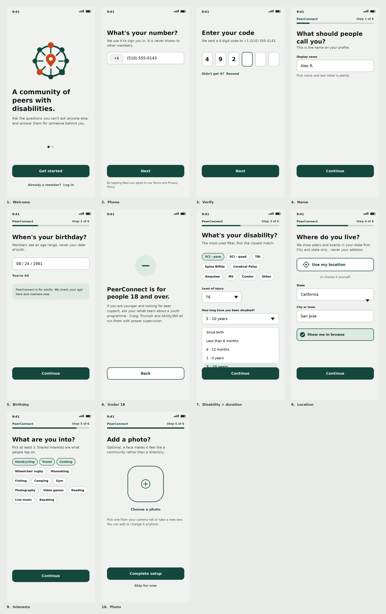
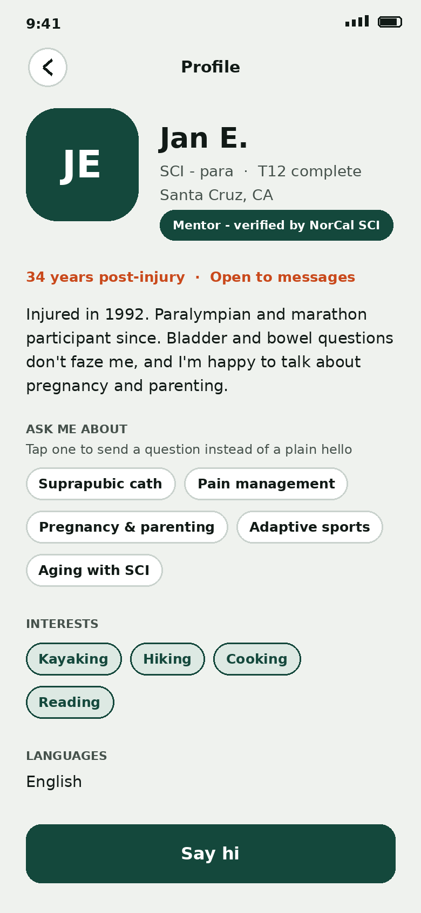
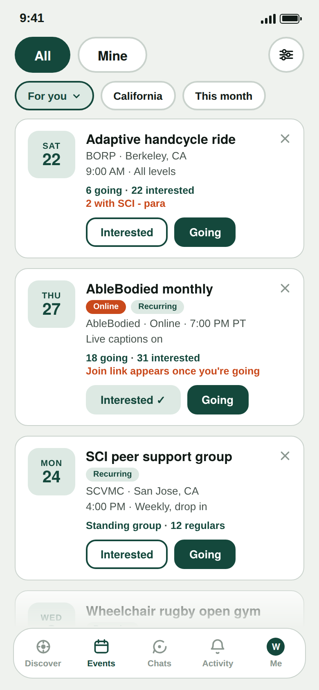
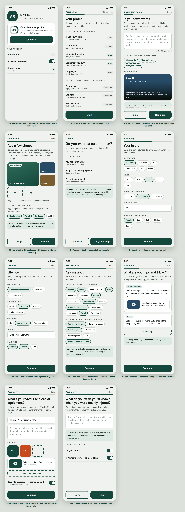

# PeerConnect — PRD

*Find peers. Find mentors. Find something to go to.*

**Status:** v5 · **Owner:** Wojtek · **Last updated:** 16 August 2026

> Living document. Edit it here and open a PR — this replaces the Google Doc versions,
> which lost their images and comments every time they were regenerated.
> Screens live in [`docs/screens/`](screens/) and update with the doc.

---

## 1. Summary

PeerConnect is a mobile app where people with spinal cord injuries find peers, find mentors, and find something to go to. It borrows its mechanics from Bumble BFF — build a profile, browse profiles, connect — and adds an events layer that gives organizations attendance and outcome data in exchange for bringing their members in.

## 2. Problem

Peer mentor programs are matched by hand. At Craig Hospital one coordinator connects newly injured people to mentors out of a spreadsheet, with no way for a mentee to browse and choose for themselves, and no way to see whether a connection actually happened.

The harder half is the mentee side. Reaching out to a stranger is a big ask three months post-injury. So the first thing someone does inside the app should not be composing a message — it should be looking at people who resemble them and events happening this week. Browsing is free once you are in. Filtering is free. Saying hi is one tap. Writing a message comes last.

**Sign-in is required to see members** — see [§5.1](#51-what-is-public-and-what-is-not). Earlier drafts implied you could browse before signing up. That was wrong and is corrected here.

Separately, there is no single fresh list of adaptive events. Every organization runs its own calendar and its own newsletter, and people do not read newsletters. Good events go half empty while people who would have gone never hear about them. **The trap is repeating the same failure in a new wrapper:** if we push events nobody cares about, people learn to ignore our notifications exactly as they learned to ignore the newsletters. Relevance rules are in [§9.4](#94-relevance-so-we-do-not-become-the-newsletter), and they are not optional.

## 3. Who it is for

- **Newly injured people** — want answers and someone who has been there. Hardest to reach.
- **Experienced peers and trained mentors** — willing to help, currently reachable only through a coordinator.
- **Family members and caregivers** — a real mentor category. One of NorCal SCI's 25 listed mentors is a parent rather than a person with SCI.
- **Organizations** — hospitals, foundations and adaptive sports programs who need attendance and outcomes they can report to funders.

**Adults only.** See [§6.2](#62-age-gate--18-confirmed).

## 4. Goals

- A person can sign up in about two minutes and immediately see relevant peers and events.
- A mentee can start contact with one tap, and with something better than "hi".
- A mentor can control how much contact they receive.
- Anyone can find an adaptive event near them — or online — without subscribing to twelve newsletters.
- An organization can see how many connections came out of its events.

**Non-goals for v1:** a discussion forum, a wiki, a classifieds marketplace, distance-based matching, and any matching algorithm beyond disability and location.

## 5. Rough overview

**Peers** and **Mentors** are segmented pills at the top of Discover; **Events** and the rest sit in the bottom bar. Horizontal swipe cycles between Peers and Mentors; the pills do the same with a tap. See [§7.2](#72-gestures).

Two profile depths. Everyone becomes a **Peer** after onboarding. Peers upgrade to a longer **Mentor** profile later ([§10](#10-becoming-a-mentor)). Organizations enter through a separate web form and claim flow, not through the app.

**SCI first.** Messaging, seed content and the launch story are SCI, so everyone shares a vocabulary from day one. The schema stays general and nobody is turned away at signup.

### 5.1 What is public and what is not

Two tiers, and the line sits between content and people.

| Public, no account | Behind sign-in |
| --- | --- |
| Events, including virtual ones Organization profiles Marketing pages | Every peer and mentor profile Photos, names, bios, topics Waves, messages, rosters |

Rationale, in order of weight:

- **Erik asked for it.** Craig will not put its mentors behind a public URL, and without Craig there is no mentor seed.
- **Scraping.** A public directory of disabled people with names, photos, injury levels and catheter preferences is training data waiting to be taken, and it is the exact thing CareCure warned about. Member pages carry `noindex`, and the API requires a session.
- **It costs us little.** Events are the public shopfront, they are already public information, and they are the better SEO surface anyway — someone searching "adaptive handcycling near me" lands on an event, not on a stranger's profile.

The honest cost: nobody can evaluate the app before creating an account. Mitigation is that events are genuinely useful without one, and the signup is two minutes.

## 6. Onboarding

Nine screens: welcome, phone number, verification code, then six steps, of which the last two are skippable. Target around two minutes.

| Step | Screen | Notes |
| --- | --- | --- |
| — | Welcome | "A community of peers with disabilities." |
| — | Phone number | Autofilled from the device where the OS allows it. Never shown to members. |
| — | Verification code | Auto-read from the incoming SMS. Skipped entirely on an org invite link. |
| 1 | Name | Display name. First name and last initial is plenty. |
| 2 | Birthday | Age gate and age band. See [§6.2](#62-age-gate--18-confirmed). |
| 3 | Disability | Type, level if SCI, how long you have been disabled, **and what you use**. See [§6.1](#61-disability-duration-and-what-you-use). |
| 4 | Location | "Use my location" or state and city. See [§6.3](#63-location-asked-in-context). |
| 5 | Photo | Optional, skippable. See [§6.4](#64-photos). |
| 6 | Interests | **Optional.** Moved after the photo — skipping the photo skips this too. |

### 6.0 Making it shorter

Ran's point stands: screens 2 and 3 are the two that add nothing the user wants. We keep phone verification, but reduce it to near-zero cost rather than removing it:

- **Autofill the number.** Both platforms offer it. One tap instead of ten digits.
- **Auto-read the code.** iOS surfaces the OTP above the keyboard; Android's SMS Retriever fills it without a permission prompt.
- **Org invite links skip verification entirely.** A mentor arriving on Erik's link is already vouched for by an organization — a stronger signal than a phone number. See [§11.1](#111-getting-an-organizations-mentors-in--the-seeding-story).
- **Interests moved after the photo and made optional.** They feed the shared-interest line, which is nice but not load-bearing.

**Why keep phone at all:** it is our only anti-spam measure at launch, and a real number is useful for a coordinator who needs to reach someone. If it turns out not to be the bottleneck, it can become optional later — the reverse is much harder.

### 6.1 Disability, duration, and what you use

Three controls on one screen.

**Type** — SCI-para, SCI-quad, TBI, Spina Bifida, Cerebral Palsy, Amputee, MS, Combo, Other. Level appears only for SCI and Combo.

**How long have you been disabled** — a dropdown, not a date. Since birth · Less than 6 months · 6–12 months · 1–3 years · 3–10 years · 10+ years. A bucket is easier to answer than a date, and "since birth" becomes a normal option rather than an escape hatch. Pre-select it for congenital types and let people change it.

> **Implementation note.** Store the bucket *and* `durationAnsweredOn`, and roll people forward — see `currentDuration()` in `src/mocks/selectors.ts`. Otherwise the "newly injured" segment slowly fills with people who are not, and the routing below quietly stops working.

**What you use** — new, and here rather than buried in the mentor flow: manual chair · power assist · power chair · scooter · crutches or walker · walks unaided · prefer not to say. Multi-select, one tap. This exists because equipment is now a top-level filter ([§7.1](#71-filters)), and a filter cannot depend on an optional section of a flow most people never start.

**On Ran's question — is MS part of SCI?** No. Multiple sclerosis is a demyelinating disease of the central nervous system: the immune system attacks the myelin sheath around nerves in the brain and spinal cord. A spinal cord injury is physical damage to the cord itself, usually from trauma. Different cause, different course — MS typically progresses or relapses over time, while an SCI is a single event followed by recovery and adaptation.

What they share is downstream: mobility loss, spasticity, neurogenic bladder and bowel, fatigue, pain. That overlap is why someone with MS can get real value from an SCI peer network and why keeping them in the list is right. It is also why MS has no single onset date and defaults to a duration bucket.

**Time since disability routes the app.** It is the strongest segmentation variable we have.

|  | Under a year | Over a year |
| --- | --- | --- |
| Wants | Answers, proof it gets better | People to do things with |
| Best match | Someone five to ten years ahead | Someone at a similar stage |
| Lands on | Mentors | Peers or Events |
| Tone | Quiet, low pressure | Invitational |

### 6.2 Age gate — 18+, confirmed

Alfred's question was whether an under-18 should be able to find an under-18 mentor. The answer for v1 is no, and everyone landed in the same place: start at 18, revisit later.

PeerConnect lets adults send unsolicited direct messages and routes people toward meeting in person. A minor with a new injury could be messaged privately by any adult and invited to a meetup. No consent checkbox solves that, and it is the kind of thing that ends a hospital partnership rather than starting one. Teenagers with SCI genuinely need peer support — Craig, Triumph and Ability360 already run youth programmes with trained staff and supervision, and the block screen points there rather than just refusing.

Three mechanics that make the gate real:

- **Ask the birthday before stating the rule.** Leading with "you must be 18" tells people what to type.
- **Persist the failure** against device and number, so a blocked person cannot retry with a different year.
- **Keep the date only as long as needed.** Check the age, store the band plus month and day, discard the year.

If under-18s are ever in scope it is a separate mode: verified parental consent, no adult-initiated DMs, moderated conversations, no unaccompanied RSVPs. Legally complicated and far bigger than a date field.

### 6.3 Location, asked in context

No permissions screen. The prompt fires from a **Use my location** button on the "Where do you live?" step, so the request arrives with its reason on screen.

- **State and city fields are always visible**, not revealed after a denial. On iOS a denied location permission cannot be re-prompted, so a reflexive "Don't Allow" would otherwise be a dead end mid-onboarding.
- **Convert and discard.** Reverse-geocode to postal code, city, state, country; store those; throw the coordinates away.
- A **Show me in browse** toggle sits on the same screen, defaulted on.

**Notifications are not asked for during onboarding.** Ask at the first wave received: "Someone waved at you. Want to know when that happens?" Highest intent in the product, and iOS gives exactly one chance at that dialog.

> **PWA note.** On iOS, web push only works once the app is added to the Home Screen. The first-wave moment becomes two steps — add to Home Screen, then permission — and needs its own design.

### 6.4 Photos

Optional and never required — not for Peer, not for the Mentor badge. A required photo silently filters out the hardest-to-reach users. Last step, skippable, upload or camera, and **skipping leaves no visible hole**: no nag bar, no completeness meter. The generated initial tile reads as a design choice; a grey silhouette reads as broken.

Also: an **alt-text field**, and **photo visibility separate from profile visibility** — photo plus disability plus city is identifying, and someone in a small town should be able to show a face to members without it being on the open web. For mentors, guide the shot: doing something you love, face visible.

## 7. Peers and Mentors

The tab is **Peers**, not People — it is the word the community uses and the word the rest of the product uses.

### 7.0 Full-bleed cards

Modelled directly on Bumble BFF. **The photo is the card.** It fills the frame edge to edge, roughly two thirds of the screen, and everything else sits on top of it: name and details over the image at the top, bio and interest pills over a dark scrim at the bottom, and a large circular wave button in the lower right. One card per screen, scrolled vertically.

- **A photo carries what text cannot** — the chair, posture, hand function, whether someone is outside doing something. A newly injured quad seeing another quad on a trail gets "this is possible" in a way no bio delivers. Giving it the whole frame is the point.
- **Density advertises emptiness.** At launch a state may hold three people. A compact list of three rows makes a screen that is visibly nine-tenths blank; three full-screen cards read as a considered selection rather than everything we have. **We are deliberately trading profiles-per-screen for how the screen feels when there are few.** Revisit when a typical state returns twenty or more.
- **The wave is a large circular button on the card**, not a small link in a row. It is the primary action in the product and should be the largest tap target on screen.

What sits on the card, in order: name, then **disability, level and what they use** — where Bumble puts age and city, we put the things that decide whether this is the right person. Age and city go on the second line. A pill shows time since injury. The bio truncates at three lines. Interest pills scroll horizontally along the bottom and deliberately run off the edge, which signals there is more.

Where there is no photo, the generated initial tile fills the same frame — a large block of colour with the initials, which reads as a design choice rather than a missing image. This is what makes the photo genuinely optional ([§6.4](#64-photos)).

Mentor cards add the org badge and capacity. **Watch this one:** a full-bleed card shows less at a glance, and Mentors is closer to a decision than a browse — someone is comparing four people on whether they are open and what they will discuss. It may want a shorter card than Peers. Judge it on a real phone.

**Navigation follows from the card.** With cards this large, Peers and Mentors become segmented pills at the top of a Discover surface rather than top-level tabs, and the bottom bar carries sections: **Discover · Events · Chats · Activity · Me**. That is Bumble's structure and it is defensible here — Events is not a kind of person, and Chats and Activity need somewhere to live. It does supersede the three-tab model in [§5](#5-rough-overview); if we would rather keep Peers / Mentors / Events as the bottom bar, the card design still works, but Chats and Activity need another home.

### 7.2 Gestures

- **Horizontal swipe cycles Peers and Mentors.** Left or right moves between the two segments, and the top pills do exactly the same thing with a tap. Two segments only, so it stops at each end rather than wrapping — with two items a wrap reads as a glitch.
- **Vertical scroll moves through cards**, one card per screen.
- **Swipe is an accelerator, never the only way.** Every gesture has a tap equivalent, because switch control, keyboard and VoiceOver users cannot reliably swipe. This is the same rule that ruled out swipe-to-decide in the first place.

**Two gesture conflicts to handle, both real:**

- **The interest pills at the bottom of a card scroll horizontally.** A drag that starts on that strip scrolls the pills; it must not change segment. Standard nested horizontal scrolling — the inner scroller claims the gesture, and only hands it up once it hits its own end.
- **iOS reserves the left screen edge.** In a PWA or browser tab, a swipe starting within roughly 20px of the left edge is the system back gesture and we do not get it. Ignore gestures originating at the very edge rather than fighting for them, or people will get inconsistent behaviour depending on where their thumb landed.

### 7.1 Filters

| On the bar | Behind Filters |
| --- | --- |
| State · Disability | **Equipment** · **Organization** · Level · Time since disability · Languages · Topics · Age band |

**Equipment earns its place.** Ran is right that manual versus power is a large difference in daily life — arguably larger than two levels of injury — and someone in a power chair mostly wants to talk to someone in a power chair. It stays one tap away rather than on the bar because the bar has room for two chips on a phone. If usage says otherwise, swap disability out.

**Organization as a filter** means someone can find their own hospital's mentors, which is exactly how a person referred by Craig will look.

## 8. Profile and the wave

A profile carries the photo, bio, what they use, the topics they will discuss, interests, languages, equipment, grants and affiliation. The primary action is **Say hi** — one tap, no words required.

- **Peer to peer:** a wave back opens the thread. Either side can message first instead.
- **Anyone to a mentor:** if the mentor is open, the wave lands in their inbox and the thread opens immediately. No mutual match — mentors have already volunteered.
- Waves arrive in their own inbox, separate from messages, and are rate limited.
- Mentors set capacity: open, at capacity, or paused.

### 8.1 Ask me about

Ran's idea, and the best thing to come out of the v4 comments. The topics list stops being a static description and becomes the opener.

**"Happy to talk about" becomes "Ask me about"**, and every chip is tappable. Tapping *Suprapubic catheter* sends *"Hi — I have a question about suprapubic catheters."* rather than a bare wave. See `openerFor()` in `src/mocks/selectors.ts`.

Why this matters more than it looks:

- **It solves the blank page.** The hardest thing about the first message is not courage, it is not knowing what to write. This writes it.
- **It is better for the mentor.** A wave is an obligation with no content; "a question about catheters" is answerable in two minutes.
- **It grades the ladder more finely.** Read → wave → **ask about one thing** → write freely → meet.
- **It generates data.** Which topics get tapped tells us what people actually need help with, which feeds the topic list, the mentor recruitment pitch and the events we prioritise.

Keep the plain wave as well — some people want to say hello without declaring a problem, and someone three months in may not know what to ask yet. The opener text is editable before sending.

## 9. Events

A dated list, filtered by state and time window. Each card carries the date, event, host organization, place and time, and the line that drives attendance: **who else is going, and how many share your injury level**.

**Recurring groups are seeded first.** Standing weekly and monthly groups never go stale, so the tab always renders something in a quiet month. Badged as recurring rather than given an RSVP.

### 9.1 Keeping the list fresh

Freshness is the whole risk of this tab, and it is a job, not a script. **Name an owner.** One person owns event ingestion — adding sources, watching the review queue, chasing dead feeds. If nobody owns it, it decays in about six weeks and the tab becomes a liability.

Three ingestion routes, in order of reliability:

1. **Calendar feeds.** Most organizations publish a calendar, and many expose iCal or RSS behind it. Re-sync nightly. The only route that self-corrects when an event is cancelled or moved.
2. **Newsletters.** A dedicated inbox subscribed to every organization's list, parsed into candidate events. Reaches the many programs that announce by email and never update a calendar. Parsed events land in a review queue, not straight into the tab.
3. **Aggregators and scraping.** sportsabilities.com and adaptiverechub.org for breadth at launch.

**Rules that keep it honest:** every event shows its source and last-verified date; anything missing from its feed for two sync cycles is unpublished automatically; past events disappear the next day; a claimed organization's own edits beat the scraper.

### 9.2 Virtual events

In scope, and the only content that makes the tab non-empty *everywhere*. Someone in Boise has nothing local on day one but can still join a monthly. Seed with the AbleBodied monthly, the Men's SCI group, and partner sessions.

- **They ignore the state filter**, with a toggle to hide them. When a state filter returns nothing local, the empty state fills with virtual. See `filterEvents()` in `src/mocks/selectors.ts`.
- **Cards show time zone, not city** — "Online · 7:00 PM PT", with the viewer's local time when it differs.
- **Join in one tap, from the app.** Once you have RSVPed, the event page carries a Join button that opens the meeting directly. A reminder with the same button fires shortly before. The link is never on a public card: support groups have been a recurring target for meeting disruption.
- **Check-in without a QR code.** The host opens a check-in window that attendees confirm in the app, or marks the roster afterwards.
- **Rosters are more sensitive here.** Host sets visibility per event — full roster, first names only, or off — and support-group-shaped events default to conservative.

**Pilot:** run the AbleBodied monthly through the full loop first.

### 9.3 Check-in and the organization loop

Members RSVP and see who else is going. They check in on the day, which unlocks the attendee roster — visible only to people who attended. Afterwards: a shared photo album, one-tap "add the people you met", and a testimonial prompt two days later.

**Why an organization will push adoption.** The dashboard gives them attendance over time, **new connections formed between attendees**, testimonials with consent for grant reports, and repeat attendance. "12 events for 340 people" is a weaker grant line than "12 events and 190 new peer connections". We can produce the second number; nobody else can. **This is the single clearest thing we give organizations, and it should lead every conversation with one.**

### 9.4 Relevance, so we do not become the newsletter

Ran's warning is the real risk: irrelevant notifications train people to ignore all of them, and then we have rebuilt the thing we replaced.

- **Not interested.** Dismiss any event and we stop surfacing that activity type. Three scuba events in a row is exactly how the tab dies.
- **Follow and mute per organization and per activity.**
- **The dumb algorithm is fine to start.** Same disability, same state, plus an activity you listed is already a strong match — no ranking model needed at this size.
- **Notification budget.** A hard cap per person per week, spent on the highest-scoring item. Digest by default, immediate only for waves and messages.
- **Measure it.** Notification open rate and mute rate as health metrics. If open rate falls, cut volume before adding features.

## 10. Becoming a mentor

The Craig survey reshaped from a one-shot questionnaire into a living profile. **Sectioned and saveable**, and **every field earns its place** — a question goes in only if it becomes a filter or a visible line on the profile.

**Prompt the upgrade on a signal, not at signup.** After a few replied waves, or after attending an event: "You have helped three people this month. Want a mentor profile?"

### 10.1 The sections

| Section | Fields |
| --- | --- |
| **0. In your own words** *(required)* | A few sentences on who you are. Asked first, because it is the thing people actually read. |
| **1. Your injury** *(required)* | Age at injury; how you were injured; level; complete / incomplete / do not know |
| **2. Life now** *(required)* | Independence; living situation; relationship status; children and pre- or post-injury; education; employment and field; languages |
| **3. Ask me about** *(required)* | Areas of concern; self-care devices and procedures; plus **"something you have done since your injury that you never thought you would"** — free text, and likely the most-read line on any profile |
| **4. Equipment you own** | See [10.2](#102-equipment-you-own) |
| **5. Grants you've received** | See [10.3](#103-grants-received) |
| **6. Your story** | Photo; three prompts — what a good weekend looks like now, what you wish someone had told you in the first year, who you would most like to hear from |

Sections 0–3 are required for the badge. 4 to 6 make a profile better, not valid.

**Free text beats a fixed list where the Craig options run out.** NorCal's mentors describe topics well outside Craig's checkboxes — pregnancy during paraplegia, business ownership, infertility, emergency preparedness. Keep the checklist for filtering and free text for the rest, and let popular free-text answers graduate into the list.

### 10.2 Equipment you own

Now doing double duty: a filter ([§7.1](#71-filters)) and an offer. Chair *type* is captured in onboarding for everyone; this section adds the detail.

- **Make and model** — free text, because the specifics are the point. "TiLite ZRA with SmartDrive" tells another user far more than "manual".
- **Adaptive sports equipment** — handcycle, monoski or sit-ski, sport wheelchair, racing chair, off-road or trail chair, kayak, FES bike, standing frame, adaptive climbing, hunting or fishing rig, scuba, other, none.
- **"Happy to advise, or let someone try it"** — the toggle that turns a spec list into an offer. Pair it with an **Ask me about** chip so someone can tap straight through to "can I try your handcycle?"

### 10.3 Grants received

Multi-select: Kelly Brush, Challenged Athletes, Reeve Quality of Life, Triumph, High Fives, Swim with Mike, state Department of Rehabilitation, VA, other, none yet. Plus **happy to help someone apply**.

**Never collect or display amounts** — which grants, not how much.

### 10.4 Visibility

Per-section visibility: public, members only, or hidden. Section 3 defaults to members only. With [§5.1](#51-what-is-public-and-what-is-not) in force, "public" now means visible to any signed-in member rather than to the open web.

## 11. Organizations

Organizations have no browse tab but keep profiles, verification, event management and the dashboard. They are reached from any event they host, from the badge on a mentor's profile, and from search.

### 11.1 Getting an organization's mentors in — the seeding story

This is how the app gets its first real users, and it deserves to be a designed flow rather than an afterthought.

1. A coordinator — Erik at Craig, Tricia at NorCal — gets a **unique invite link** for their organization.
2. They send it to their existing mentors however they already communicate.
3. Anyone arriving on that link **skips phone verification** and lands in onboarding, already tagged to that organization.
4. On completion they are **pre-vouched** — the org badge is applied automatically, and finishing sections 0–3 makes them a Mentor with no manual approval.
5. The coordinator gets a page showing who has joined and who has not.

**This also solves re-consent.** The link *is* the consent step: a mentor who signs up through it has actively opted in, which is exactly what the Craig data cannot give us. It replaces an awkward legal conversation with a link and a sentence.

**Invite links need limits** — they bypass our only spam control. Expiring, revocable, capped, and traceable to the coordinator who owns them.

### 11.2 Badges, filtering and following

- **Org badges on profiles.** "Verified by Craig Hospital" is worth more than any check we could perform ourselves.
- **Organization as a filter** on the Mentors tab.
- **Follow an organization** — Alfred's idea. Following puts their events at the top of your Events tab and is the opt-in half of [§9.4](#94-relevance-so-we-do-not-become-the-newsletter). A public follower count gives organizations a reason to promote their page. Worth building once there are enough orgs for a ranking to mean anything.

## 12. Mentors and verification

No selfie verification and no facial recognition at launch. Mentors are vouched for by their organization.

| Label | How you get it | What it means |
| --- | --- | --- |
| Peer | Finish onboarding | Browsing, waving, messaging, RSVPs |
| Experienced peer | Complete sections 0–3 | Been at this a while, happy to talk |
| Mentor | Sections 0–3 plus an organization vouches | Trained and verified by a program |

Both labels ship. Craig's mentors complete suicide prevention training; Triumph runs a ten-hour ambassador conference. A self-serve mentor badge would put untrained strangers in front of people who may be in crisis, and no hospital will attach its name to that. "Experienced peer" is the honest home for someone who has done the work but has no organization behind them.

## 13. Data and seeding

| Source | What it gives | Consent status |
| --- | --- | --- |
| Org calendar feeds and newsletters | The live events database | Public / opt-in subscription |
| AbleBodied monthly, Men's SCI group | Recurring virtual events from day one | Ours / partner |
| sportsabilities.com, adaptiverechub.org | Events across most states at launch | Public listings |
| Existing org list | Org profiles | Public |
| Craig and NorCal mentors via invite link | Vouched mentors who signed up themselves | **Consent by signup — the clean path** |
| Craig / NorCal spreadsheets as a bulk import | ~70 profiles | **Blocked** — not consented for this app |

The invite link in [§11.1](#111-getting-an-organizations-mentors-in--the-seeding-story) makes the bulk import unnecessary. Use the coordinator's reach, not their spreadsheet.

**Imported profiles have no time-since-injury** either way — NorCal publishes birth year but no injury date, and Craig's Q6 and Q7 are empty. The onboarding dropdown collects it properly.

> **Prototype data.** `src/mocks/seed.ts` is entirely synthetic — 65 invented people, 10 events, 18 real organizations. No real person's name, photo or contact details, including from any public org page. See [`docs/PII.md`](PII.md).

## 14. Privacy

- Member profiles require a session. Pages carry `noindex` and the API is not public.
- Date of birth is checked at the gate, then reduced to an age band plus month and day; the year is discarded.
- Time since disability is shown as a range, never a date.
- Location is city and state. Coordinates from "Use my location" are converted and discarded.
- Appearing in browse is opt-in and can be switched off without losing browse, wave or RSVP.
- Photos are optional, have their own visibility setting, and carry alt text.
- Attendee rosters are visible only to people who attended, with host-controlled visibility.
- Grant amounts are never collected. Email and phone are never exposed between members.
- Block and report on every thread; recipients can turn off unsolicited waves and messages.

## 15. Success measures

- Onboarding completion rate, and drop-off by step
- Invite-link conversion per organization — the seeding metric
- Photo attach rate, and wave rate with a photo versus without
- **Waves and "Ask me about" taps sent, and reply rate for each** — if the topic openers out-reply plain waves, lean into them
- Events live, and percentage verified in the last 7 days
- Notification open rate and mute rate — the early warning that we are becoming the newsletter
- RSVPs per event, check-ins as a share of RSVPs, virtual versus in-person split
- **Connections formed per event** — the number we sell to organizations
- Peers who start the mentor flow and finish sections 0–3
- Repeat attendance after meeting someone at a first event

## 16. Build order

1. Onboarding, Peer profile, Peers browse, the wave
2. "Ask me about" openers and messaging; notification ask at first wave
3. Events tab, ingestion, RSVP, virtual events with one-tap join
4. Org invite links and pre-vouching — the seeding flow
5. Mentor upgrade flow, capacity controls, org badges and filter
6. Check-in, attendee roster, post-event album, org dashboard
7. Follow organizations, "not interested", notification budget

The hackathon build is step 1 only. See [`WORKPLAN.md`](WORKPLAN.md).

## 17. Open questions

1. **Spam, and whether phone verification is enough.** It is what we have at launch and it is cheap. If AI-generated signups become a real problem, the escalation path is a verification vendor rather than hand-approval — CareCure approves every account by hand and it is why they are exhausted. Two caveats before committing to face verification: it needs a manual-review alternative, because framing your own face at arm's length is not neutral for someone with limited grip; and it is a meaningful trust and cost decision, not a switch. Revisit when we see the abuse, not before.
2. How much of newsletter parsing can be automated before a human reviews the queue? Assume a review step for v1.
3. Do we still want an exact injury date for an opt-in "alive day" greeting? It belongs on the profile, not in onboarding, and needs its own opt-in — for many people the date is a grief anniversary.
4. Who moderates a virtual event that goes wrong — the host organization, or us?
5. Does the Events tab need a public web view for SEO, given members are behind sign-in?

## 18. Later, not now

### Forums — partner with CareCure rather than run our own

A **Forums** tab replaces Activity in the bottom bar at some point. We do not build the forum.

CareCure is a twenty-five-year-old SCI forum already running on Discourse, with around 20,000 registered accounts — and roughly 50 monthly actives. That second number is the warning, not the opportunity: a forum with no posts is worse than no forum, and unlike events it cannot be seeded from public data. Starting a second SCI forum next to a struggling one splits an already thin community twice over.

**What we bring them is the thing they actually lack.** CareCure hand-approves every account because AI-generated spam overwhelmed them. Every PeerConnect member is phone-verified, and mentors are vouched for by a hospital or foundation. A member arriving through us is pre-vetted in a way a cold signup never is, which removes the work that is exhausting them — and they have said they are looking for new blood.

**How to integrate, in increasing order of effort:**

| Step | What it takes |
| --- | --- |
| Forums tab opens CareCure in a full-page view | Hours. Zero operating cost, no servers, no moderation burden. |
| Single sign-on via DiscourseConnect | About a day on our side — one endpoint and a shared secret — plus two settings in their admin. Members land already signed in. |
| A PeerConnect category inside CareCure | Their decision. Gives our arrivals somewhere obvious to land rather than dropping them into a 25-year-old archive. |
| Surface their latest topics in our app via `/latest.json` | A day. A strip of recent threads on Discover, deep-linking into CareCure. |

**Do not iframe it.** Safari blocks third-party cookies, so an embedded Discourse session breaks on iOS. Full-page navigation or an in-app browser, not an iframe.

**Do not host our own Discourse.** Postgres, Redis, SMTP deliverability, backups and security patching are a standing commitment, not a build task — about $100 a month managed, or a person if self-hosted. All of that to compete with a partner.

**Open:** moderation stays theirs, which is the right answer but means our members are subject to their rules and their moderators. Worth agreeing explicitly before we send anyone. And if they decline, the fallback is not our own general forum — it is discussion attached to things that already have people in them, like a thread per event visible to everyone who RSVPed.

- **Vacation exchange.** Wojtek's idea, with Alfred's addition: members list a spare room and whether they would host someone. Genuinely valuable — accessible accommodation is hard to find and expensive, and a peer's spare room is already adapted. It is also a different risk class from messaging: someone staying overnight in a stranger's home needs verification, reviews, and a clear line on what we are responsible for. Worth building once there is a real community with a reputation system.
- **Follower counts and an organization directory ranked by them** — see [§11.2](#112-badges-filtering-and-following).
- **Equipment marketplace or lending** — the natural extension of [§10.2](#102-equipment-you-own).
- **Youth mode** — see [§6.2](#62-age-gate--18-confirmed).

---

## Change log

| Version | Change |
| --- | --- |
| v5 | Comments from Ran, Alfred and Wojtek on v4 incorporated: sign-in required, Peers rename, Ask me about, equipment filter, org invite links, shorter onboarding, vacation exchange. Moved into the repo as markdown. |
| v4 | Onboarding fully specified: six steps, 18+ gate, duration bucket, optional photo, location asked in context. |
| v3 | Virtual events; mentor upgrade flow with equipment and grants. |
| v2 | Events replaced Orgs as the third tab. |
| v1 | Bumble BFF model, three tabs, wave, org loop. |
